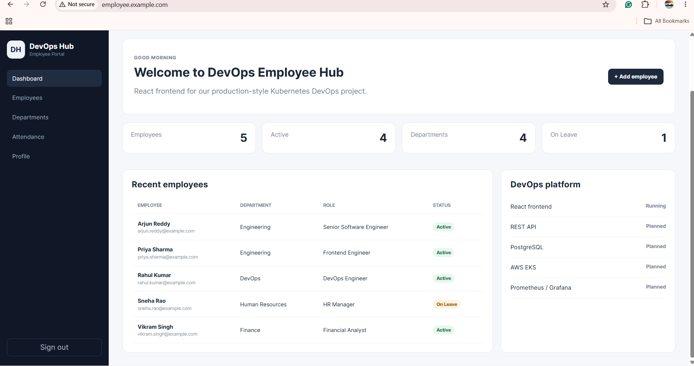

# DevOps Employee Hub

React frontend for the Kubernetes/DevOps portfolio project.

This project demonstrates an end-to-end DevOps workflow using:

- React
- Docker
- AWS ECR
- Terraform
- Amazon EKS
- Kubernetes
- Helm
- NGINX Ingress Controller

---

# Architecture

```text
Developer
   |
   | Git
   v
GitHub
   |
   | Docker Build
   v
Docker Image
   |
   | Push
   v
AWS ECR
   |
   | Pull
   v
Amazon EKS
   |
   +----------------------+
   |                      |
   v                      v
Deployment             Service
   |                      |
   |                 NodePort :30080
   |
   +----------+
   |          |
   v          v
 Pod 1      Pod 2
   |
   v
NGINX
   |
   v
NGINX Ingress Controller
   |
   v
AWS Load Balancer
   |
   v
employee.example.com
```

# Project Structure
```
devops-employee-hub/
│
├── src/
│   ├── services/
│   │   └── api.js
│   └── ...
│
├── Dockerfile
├── .dockerignore
├── .gitignore
├── package.json
├── README.md
│
├── Terraform/
│   ├── provider.tf
│   ├── variables.tf
│   ├── terraform.tfvars
│   ├── vpc.tf
│   ├── output.tf
│   ├── iam.tf
│   ├── eks.tf
│   ├── addons.tf
│   └── ecr.tf
│
└── employee-app/
    ├── Chart.yaml
    ├── values.yaml
    └── templates/
``` 

# React Application 
* Install Dependencies 
```sh
npm install 
```
* Run Locally 
```sh
npm run dev 
```

* Build 
```sh
npm run build
```

# Terraform 
Terraform is used to provision the AWS infrastructure.

* VPC
* Public Subnets
* Private Subnets
* Internet Gateway
* NAT Gateway
* Route Tables
* EKS Cluster
* EKS Node Group
* IAM Roles and Policies
* EKS Add-ons
* ECR Repository

# Terraform Commands 
* Initialize Terraform 
```sh
terraform init 
```

* Format Terraform Files 
```sh
terraform fmt 
```

* Validate Configuration 
```sh
terraform validate 
```

* Create Execution Plan 
```sh
terraform plan
```

* Apply Infrastructure 
```sh
terraform apply 
```

* Destroy Infrastructure 
```sh
terraform destroy 
```

# Docker 

* Create Docker Image
```sh
docker build -t employee-app:v1 .
```

* Verify Docker Image 
```sh
docker image ls
```

* Run the Container 
```sh
docker run -d \
  --name employee-app \
  -p 8080:80 \
  employee-app:v1
```

* Check the Container 
```sh
docker ps 
(or)
docker ps -a 
```

* Test Application 
Open
```sh
http://localhost:8080
```
or 
```sh
http://<EC2-Public-IP>:8080
```

# ECR 

# AWS ECR

AWS ECR is used to store Docker images.

The Terraform configuration creates the ECR repository.

## Get ECR Repository URL

```bash
terraform output ecr_repository_url
```

Example:

```text
<AWS-ACCoUNT-ID>.dkr.ecr.ap-south-1.amazonaws.com/employee-app
```

## Login to ECR

```bash
aws ecr get-login-password --region ap-south-1 | \
docker login --username AWS --password-stdin \
<AWS-ACCOUNT-ID>.dkr.ecr.ap-south-1.amazonaws.com
```

## Tag Docker Image

```bash
docker tag employee-app:v1 \
<AWS-ACCOUNT-ID>.dkr.ecr.ap-south-1.amazonaws.com/employee-app:v1
```

## Push Image

```bash
docker push \
<AWS-ACCOUNT-ID>.dkr.ecr.ap-south-1.amazonaws.com/employee-app:v1
```

## Verify Image

```bash
aws ecr list-images \
  --repository-name employee-app \
  --region ap-south-1
```

---

# Amazon EKS

The Kubernetes cluster is created using Terraform.

## List EKS Clusters

```bash
aws eks list-clusters --region ap-south-1
```

## Configure kubectl

```bash
aws eks update-kubeconfig \
  --region ap-south-1 \
  --name <Cluster-Name>
```

Example:

```bash
aws eks update-kubeconfig \
  --region ap-south-1 \
  --name EKS-cluster
```

## Verify AWS Identity

```bash
aws sts get-caller-identity
```

## Verify EKS Nodes

```bash
kubectl get nodes
```

Example:

```text
NAME                                         STATUS   ROLES    VERSION
ip-10-0-3-164.ap-south-1.compute.internal   Ready    <none>   v1.36.2
ip-10-0-4-121.ap-south-1.compute.internal   Ready    <none>   v1.36.2
```

---

# EKS Add-ons

The following EKS add-ons are configured using Terraform:

* VPC CNI
* CoreDNS
* kube-proxy
* EKS Pod Identity Agent

## Verify Add-ons

```bash
aws eks list-addons \
  --cluster-name EKS-cluster \
  --region ap-south-1
```

Expected add-ons:

```text
coredns
eks-pod-identity-agent
kube-proxy
vpc-cni
```

---

# Kubernetes Verification

## Check All Pods

```bash
kubectl get pods -A
```

## Check Services

```bash
kubectl get svc -A
```

## Check Namespaces

```bash
kubectl get ns
```

## Check Application Namespace

```bash
kubectl get all -n employee
```

---

# Helm

Helm is used to package and deploy the Kubernetes application.

## Check Helm Version

```bash
helm version
```

## Create Helm Chart

```bash
helm create employee-app
```

## Lint Helm Chart

```bash
helm lint .
```

## Render Kubernetes Templates

```bash
helm template employee-app .
```

## Dry Run

```bash
helm install employee-app . \
  --namespace employee \
  --create-namespace \
  --dry-run --debug
```

## Install Application

```bash
helm install employee-app . \
  --namespace employee \
  --create-namespace
```

## Check Helm Release

```bash
helm list -n employee
```

## Check Helm Status

```bash
helm status employee-app -n employee
```

## Upgrade Application

```bash
helm upgrade employee-app . \
  --namespace employee
```

## Uninstall Application

```bash
helm uninstall employee-app \
  --namespace employee
```

---

# Kubernetes Application

The application is deployed using the following Kubernetes resources:

* Deployment
* Service
* ConfigMap
* Secret
* PersistentVolumeClaim
* Ingress

---

# Application Verification

## Check Application Pods

```bash
kubectl get pods -n employee
```

Expected:

```text
NAME                           READY   STATUS
employee-app-xxxxxxxxxx-xxxxx  1/1     Running
employee-app-xxxxxxxxxx-xxxxx  1/1     Running
```

## Check Service

```bash
kubectl get svc -n employee
```

The application uses:

```text
80:30080
```

## Check ConfigMap

```bash
kubectl get configmap -n employee
```

## Check Secret

```bash
kubectl get secret -n employee
```

## Check PersistentVolumeClaim

```bash
kubectl get pvc -n employee
```

## Check Ingress

```bash
kubectl get ingress -n employee
```

---

# NGINX Ingress Controller

NGINX Ingress Controller is installed using Helm.

## Add NGINX Helm Repository

```bash
helm repo add ingress-nginx https://kubernetes.github.io/ingress-nginx
```

## Update Helm Repository

```bash
helm repo update
```

## Install NGINX Ingress Controller

```bash
helm install ingress-nginx \
  ingress-nginx/ingress-nginx \
  --namespace ingress-nginx \
  --create-namespace
```

## Verify NGINX Controller

```bash
kubectl get pods -n ingress-nginx
```

Expected:

```text
NAME                                        READY   STATUS
ingress-nginx-controller-xxxxxxxxxx-xxxxx  1/1     Running
```

## Get Load Balancer

```bash
kubectl get svc -n ingress-nginx
```

Expected:

```text
NAME                       TYPE           EXTERNAL-IP
ingress-nginx-controller   LoadBalancer   xxxxx.ap-south-1.elb.amazonaws.com
```

AWS automatically creates a Load Balancer for the NGINX Ingress Controller.

---

# Application Ingress

The application uses the hostname:

```text
employee.example.com
```

## Check Ingress

```bash
kubectl get ingress -n employee
```

Example:

```text
NAME                   CLASS   HOSTS                  ADDRESS
employee-app-ingress   nginx   employee.example.com   xxxxx.elb.amazonaws.com
```

---

# Test Application Through NGINX Ingress

## Get the NGINX Load Balancer

```bash
kubectl get svc -n ingress-nginx
```

Example:

```text
a7aaab7b804de4472a6e869824adbce6-1709576681.ap-south-1.elb.amazonaws.com
```

## Test the Application

```bash
curl -H "Host: employee.example.com" \
http://<NGINX-LOAD-BALANCER-DNS>
```

Example:

```bash
curl -H "Host: employee.example.com" \
http://a7aaab7b804de4472a6e869824adbce6-1709576681.ap-south-1.elb.amazonaws.com
```

A successful response should return the React application's HTML.

---

# To get the IP Address 
```sh
nslookup <Loadbalancer URL>

nslookp http://a7aaab7b804de4472a6e869824adbce6-1709576681.ap-south-1.elb.amazonaws.com
```
You will get 2 IP address 

# Access Application From Browser

For local testing, the hostname can be mapped using the Windows hosts file.

Open:

```text
C:\Windows\System32\drivers\etc\hosts
```

Add the following entry:

```text
<IP-ADDRESS>    employee.example.com
```

Example:

```text
<ELB-IP>    employee.example.com
```

## Flush Windows DNS Cache

Open Command Prompt as Administrator and run:

```cmd
ipconfig /flushdns
```

Then open the application in your browser:

```text
http://employee.example.com
```

> **Note:** AWS Load Balancer IP addresses can change. For a permanent setup, use a proper DNS service such as Amazon Route 53 instead of manually maintaining the Windows hosts file.

---

# Troubleshooting

## Check Pod Status

```bash
kubectl get pods -n employee
```

## Describe Pod

```bash
kubectl describe pod <pod-name> -n employee
```

## View Pod Logs

```bash
kubectl logs <pod-name> -n employee
```

## Check Deployment

```bash
kubectl get deployment -n employee
```

## Check Service Endpoints

```bash
kubectl get endpoints -n employee
```

## Describe Ingress

```bash
kubectl describe ingress employee-app-ingress \
  -n employee
```

## Check NGINX Controller Logs

```bash
kubectl logs \
  -n ingress-nginx \
  deployment/ingress-nginx-controller
```

---

# End-to-End Deployment Flow

```text
React Application
       |
       v
     Git
       |
       v
    Docker
       |
       v
   Docker Image
       |
       v
     AWS ECR
       |
       v
    Amazon EKS
       |
       v
    Helm Chart
       |
       v
Kubernetes Deployment
       |
       +----------------+
       |                |
       v                v
    Pod 1             Pod 2
       |                |
       +-------+--------+
               |
               v
       Kubernetes Service
               |
               v
        NGINX Ingress
               |
               v
       AWS Load Balancer
               |
               v
    employee.example.com
```

## Expected Output
